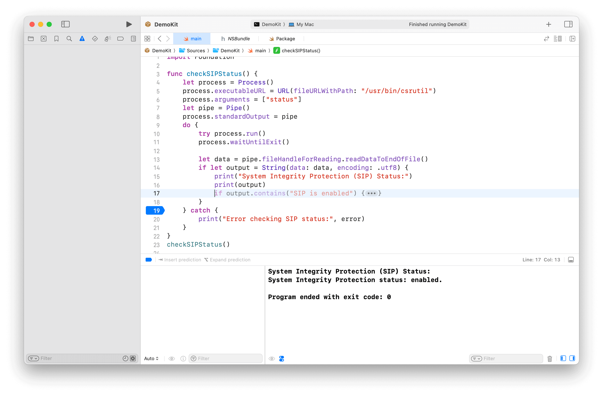
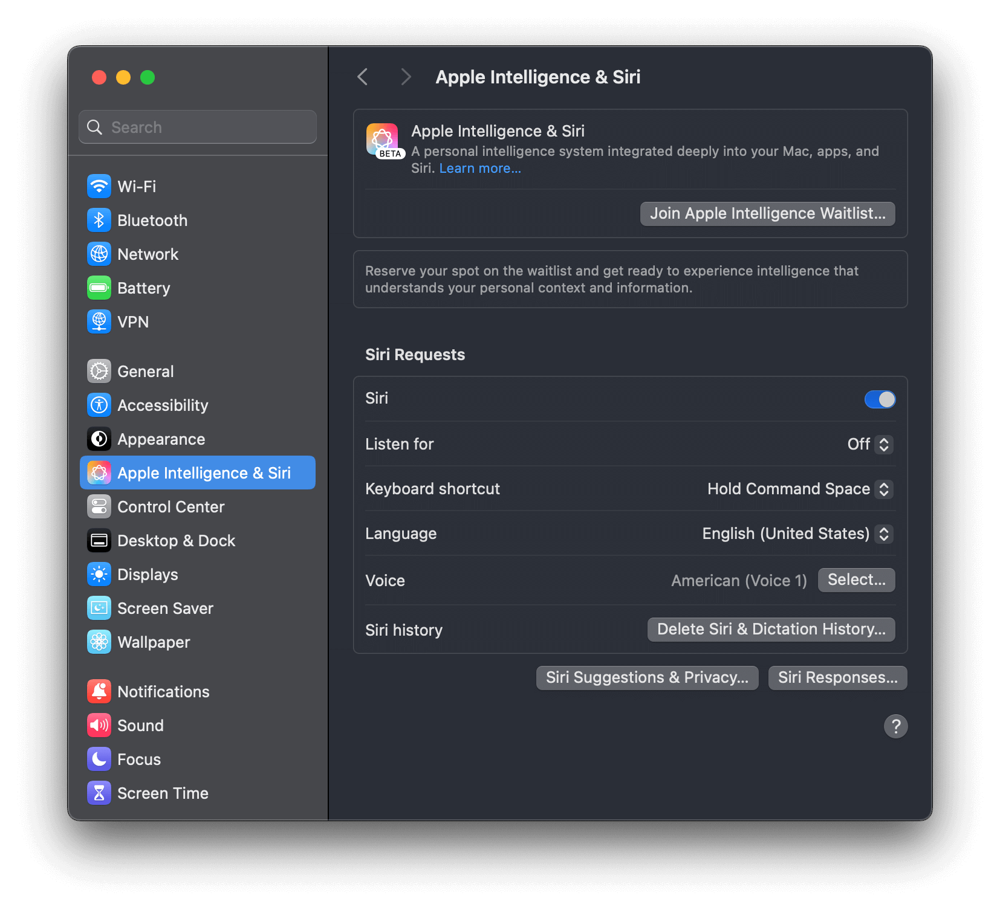
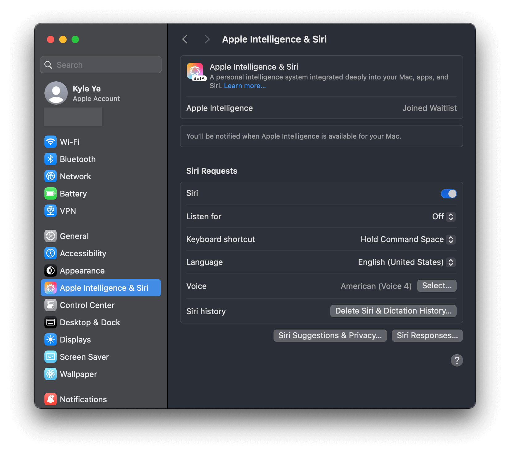
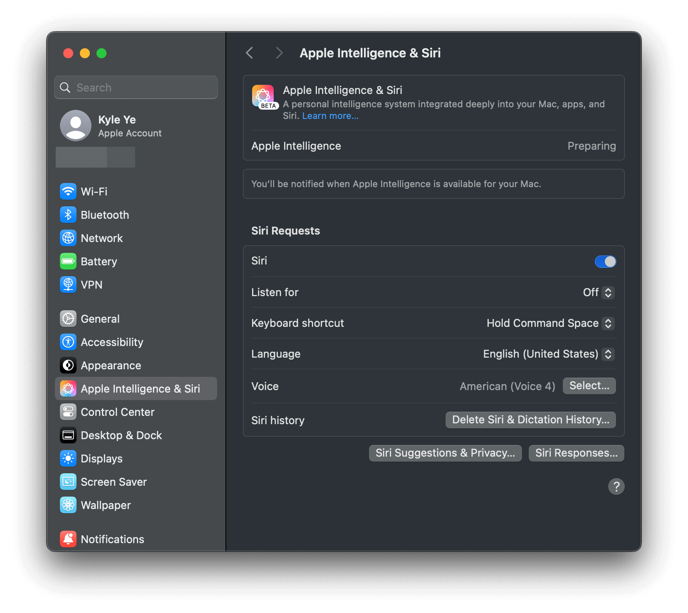
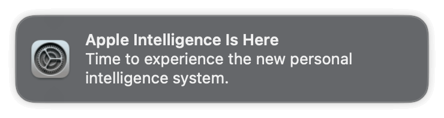
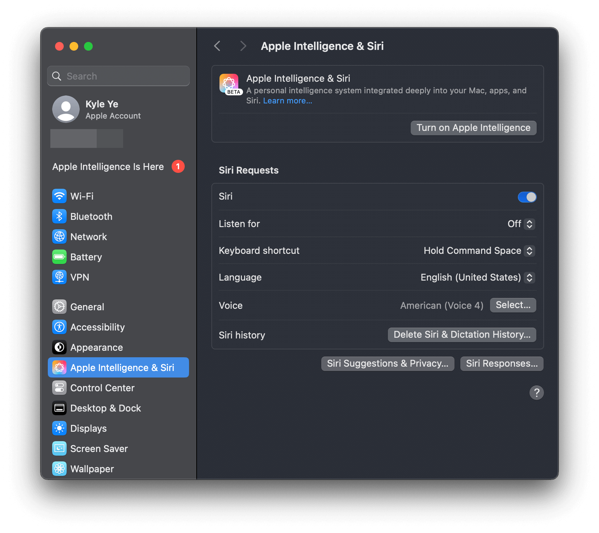

## <div align="center"><b><a href="README.md">English</a> | <a href="README_CN.md">简体中文</a></b></div>

# Darwin Eligibility Override

This project aims to achieve permanent use of Xcode LLM / Apple Intelligence / iPhone Mirroring on any Mac
without disabling System Integrity Protection (SIP) or only disabling it once.

> [!NOTE]
> Xcode LLM is only supported on macOS 15.0+
>
> Apple Intelligence is only supported on macOS 15.1+
>
> XcodeLLM, Apple Intelligence and ChatGPT integration have been tested normally on Mac mini (M4 Pro, 2024) + macOS 15.2.



## Notes

this project is for learning and research purposes only.

If you choose to use this project, you do so at your own risk and are responsible for compliance with any applicable laws.

The author of this project is not responsible for any consequences that may arise from your use of this project.

## Usage

### Method 1: util tool (Recommended)

Need one time SIP disable + "amfi_get_out_of_my_way=1" set boot-args in during the script.

> [!TIP]
> If you have issue on how to disable SIP or set boot-args, see [Manual Execution](#manual-execution) section for more detail.

```shell
# For XcodeLLM 
curl -L https://raw.githubusercontent.com/Kyle-Ye/XcodeLLMEligible/release/0.2/scripts/override.sh | bash -s -- install util xcodellm
# For Apple Intelligence
curl -L https://raw.githubusercontent.com/Kyle-Ye/XcodeLLMEligible/release/0.2/scripts/override.sh | bash -s -- install util greymatter
# For Cleanup
curl -L https://raw.githubusercontent.com/Kyle-Ye/XcodeLLMEligible/release/0.2/scripts/override.sh | bash -s -- install util strontium
# For iPhone Mirroring
curl -L https://raw.githubusercontent.com/Kyle-Ye/XcodeLLMEligible/release/0.2/scripts/override.sh | bash -s -- install util iron
```

### Method 2: override file

Do not require disable SIP at all.

```shell
# For XcodeLLM
curl -L https://raw.githubusercontent.com/Kyle-Ye/XcodeLLMEligible/release/0.2/scripts/override.sh | bash -s -- install override xcodellm
# For Apple Intelligence
curl -L https://raw.githubusercontent.com/Kyle-Ye/XcodeLLMEligible/release/0.2/scripts/override.sh | bash -s -- install override greymatter
# For Apple Intelligence + Cleanup
curl -L https://raw.githubusercontent.com/Kyle-Ye/XcodeLLMEligible/release/0.2/scripts/override.sh | bash -s -- install override greymatter+strontium
# For XcodeLLM + Apple Intelligence + Cleanup
curl -L https://raw.githubusercontent.com/Kyle-Ye/XcodeLLMEligible/release/0.2/scripts/override.sh | bash -s -- install override xcodellm+greymatter+strontium
# For iPhone Mirroring
curl -L https://raw.githubusercontent.com/Kyle-Ye/XcodeLLMEligible/release/0.2/scripts/override.sh | bash -s -- install override iron
```

> [!NOTE]
> The override file method is mutually exclusive.
>
> This repository only provides separate override files for Xcode LLM and Apple Intelligence.
>
> If you want to override multi key, please use util tool method and export the override file for your future use.

## Uninstall

### Method 1: util tool

```shell
# For XcodeLLM:
curl -L https://raw.githubusercontent.com/Kyle-Ye/XcodeLLMEligible/release/0.2/scripts/override.sh | bash -s -- uninstall util xcodellm
# For Apple Intelligence
curl -L https://raw.githubusercontent.com/Kyle-Ye/XcodeLLMEligible/release/0.2/scripts/override.sh | bash -s -- uninstall util greymatter
# For Clenaup
curl -L https://raw.githubusercontent.com/Kyle-Ye/XcodeLLMEligible/release/0.2/scripts/override.sh | bash -s -- uninstall util strontium
# For iPhone Mirroring
curl -L https://raw.githubusercontent.com/Kyle-Ye/XcodeLLMEligible/release/0.2/scripts/override.sh | bash -s -- uninstall util iron
```

### Method 2: override file

```shell
# For XcodeLLM:
curl -L https://raw.githubusercontent.com/Kyle-Ye/XcodeLLMEligible/release/0.2/scripts/override.sh | bash -s -- uninstall override xcodellm
# For Apple Intelligence
curl -L https://raw.githubusercontent.com/Kyle-Ye/XcodeLLMEligible/release/0.2/scripts/override.sh | bash -s -- uninstall override greymatter
# For Apple Intelligence + Cleanup
curl -L https://raw.githubusercontent.com/Kyle-Ye/XcodeLLMEligible/release/0.2/scripts/override.sh | bash -s -- uninstall override greymatter+strontium
# For XcodeLLM + Apple Intelligence + Cleanup
curl -L https://raw.githubusercontent.com/Kyle-Ye/XcodeLLMEligible/release/0.2/scripts/override.sh | bash -s -- uninstall override xcodellm+greymatter+strontium
# For iPhone Mirroring
curl -L https://raw.githubusercontent.com/Kyle-Ye/XcodeLLMEligible/release/0.2/scripts/override.sh | bash -s -- uninstall override iron
```

## Manual Execution

### Method 1: util tool (Recommended)

1. Disable SIP in recovery mode with `csrutil disable`

2. Add boot argument by `sudo nvram boot-args="amfi_get_out_of_my_way=1"` and reboot

3. Download `eligibility_util` from the [release page](https://github.com/Kyle-Ye/XcodeLLMEligible/releases) and add executable permission.

> The following command example assumes the downloaded file is in the `~/Downloads` folder.

```shell
chmod +x ~/Downloads/eligibility_util
```

4. Execute the following command

```shell
cd ~/Downloads
# For XcodeLLM (macOS 15.0+ required)
./eligibility_util forceDomainAnswer --domain-name OS_ELIGIBILITY_DOMAIN_XCODE_LLM --answer 4
# For Apple Intelligence (macOS 15.1+ required)
./eligibility_util forceDomainAnswer --domain-name OS_ELIGIBILITY_DOMAIN_GREYMATTER --answer 4
# For Cleanup (macOS 15.1 Beta 3+ required)
./eligibility_util forceDomainAnswer --domain-name OS_ELIGIBILITY_DOMAIN_STRONTIUM --answer 4
# For iPhone Mirroring (macOS 15.0+ required)
./eligibility_util forceDomainAnswer --domain-name OS_ELIGIBILITY_DOMAIN_IRON --answer 4
```

4. Enable SIP in recovery mode with `csrutil enable` and reboot.

5. Remove boot argument by `sudo nvram -d boot-args`

> Read [Disabling and Enabling System Integrity Protection](https://developer.apple.com/documentation/security/disabling_and_enabling_system_integrity_protection) if you are unfamiliar with SIP operation.
>
> You can only set boot-args in recovery mode or normal mode with SIP disabled.
>
> After setting boot-args, remember to reboot to make the change take effect.

> [!TIP]
>
> For more technical detail, see [Kyle-Ye/eligibility](https://github.com/Kyle-Ye/eligibility)


### Method 2: override file

No SIP disabled needed in total.

1. Download the corresponding `*.eligibility_overrides.data` file from the [release page](https://github.com/Kyle-Ye/XcodeLLMEligible/releases) and rename it to `eligibility_overrides.data`

> For Xcode LLM, download [xcodellm.eligibility_overrides.data](https://github.com/Kyle-Ye/XcodeLLMEligible/releases/latest/download/xcodellm.eligibility_overrides.data)
> 
> For Apple Intelligence, download [greymatter.eligibility_overrides.data](https://github.com/Kyle-Ye/XcodeLLMEligible/releases/latest/download/greymatter.eligibility_overrides.data)

2. Find the correct container uuid for `eligibilityd` under `/private/var/root/Library/Daemon\ Containers`

List all container uuid by the following command:
```shell
sudo ls /private/var/root/Library/Daemon\ Containers
```

3. Move downloaded file in the first step to the `Data/Library/Caches/NeverRestore/` folder of the corresponding Deamon container. If you are not sure which one is the correct container directory for eligibilityd, you can try it one by one or add the downloaded files to all Deamon containers.

```shell
sudo mkdir /private/var/root/Library/Daemon\ Containers/<UUID>/Data/Library/Caches/NeverRestore
sudo cp eligibility_overrides.data /private/var/root/Library/Daemon\ Containers/<UUID>/Data/Library/Caches/NeverRestore/
```

4. Relaunch the `eligibilityd` service

```shell
sudo pkill -9 eligibilityd
sudo launchctl kickstart -k system/com.apple.eligibilityd
```

## Trouble Shooting

> [!TIP]
> The difference of eligibility_util and eligibility_util_sip is that the former is for SIP disabled environment and the latter is for SIP enabled environment.

### Issue of Method 1: util tool 

1. If you see the following output

```shell
zsh: no such file or directory: ./eligibility_util
```

Please make sure the current working directory contains the `eligibility_util` file.

2. If you see the following output

```shell
zsh: permission denied: ./eligibility_util
```

Please make sure you have added the executable permission to the `eligibility_util` file via `chmod +x ./eligibility_util`.(Check step 3 in [Manual Execution](#manual-execution))

3. If you see the following output

```shell
>[1]    61672 killed     ./eligibility_util
```

Please make sure you have disabled SIP and set the boot-args correctly. (Check step 1 and 2 in [Manual Execution](#manual-execution))

4. Other issue

```shell
curl -L https://raw.githubusercontent.com/Kyle-Ye/XcodeLLMEligible/release/0.2/scripts/override.sh | bash -s -- doctor
```

### Issue of Method 2: override file

If you are unable to access the Daemon Container related folders, please check if the terminal app you are using has full disk access permission.

Path: Settings.app > Security & Privacy > Full Disk Access -> Add your terminal app to the list and enable it.

### Other Xcode LLM related issue

1. Confirom the override is working and you have the correct answer.

```
./eligibility_util_sip getDomainAnswer --domain-name OS_ELIGIBILITY_DOMAIN_XCODE_LLM
```

2. Reenable SIP and then open Xcode to download Model.

See detail for [#4](https://github.com/Kyle-Ye/XcodeLLMEligible/issues/4)

### Other Apple Intelligence related issue

> [!IMPORTANT]
> Suggestions:
> 1. Log in with a US Apple ID
> 2. Set Region to United States and English as the primary language
> 3. Set English (United States) as your Siri language

1. Confirom the override is working and you have the correct answer.

```
./eligibility_util_sip getDomainAnswer --domain-name OS_ELIGIBILITY_DOMAIN_GREYMATTER
```

2. Go to Setting.app and choose "Apple Intelligence & Siri", click "Join Apple Intelligence Waitlist" button.



3. You'll see "Joined Waitlist" label and wait for a while.



4. You'll see "Preparing" label and wait for a while.



5. You'll receive "Apple Intelligence is Here" notification.



6. You can now turn on Apple Intelligence to use it.



## FAQ

1. Will "Eligibility Override" still work after an OS update?

Probably yes. Eligibility Override does not require you to execute the steps again after an OS update.

But Apple may change the Eligibility mechanism in the future, so it is not guaranteed to work after an OS update.

2. Why is there no Apple Intelligence in the settings?

Apple Intelligence is only available on macOS 15.1 and later.

3. Why is there no ChatGPT related option in the settings?

ChatGPT integration is only available on macOS 15.2 and later.

4. Why does Siri still use Baidu's services after enabling Apple Intelligence (CN related)?

Siri's search engine is determined by your region language settings and network environment. Please refer to other resources on the internet for appropriate network proxy configuration.

eg. https://github.com/VirgilClyne/iRingo

5. Apple Intelligence is stuck on downloading.

Try disable and delete AssetsV2 folder after SIP disabled, then re-enable SIP.

```shell
# Disable SIP (Run on RecoveryOS mode)
csrutil disable
csrutil authenticated-root disable
# Reboot into normal macOS
# Turn off Apple Intelligence in settings
# Run on normal macOS
sudo rm -rf /System/Library/AssetsV2/*
# Enable SIP (Run on RecoveryOS mode)
csrutil enable
csrutil authenticated-root enable
# Turn on Apple Intelligence in settings to download it again (com.apple.MobileAsset.UAF.FM.GenerativeModels)
```

> See [#62](https://github.com/Kyle-Ye/XcodeLLMEligible/issues/62#issuecomment-2541993096).

6. Why I can use ChatGPT in Apple Intelligence?

It is probably caused by network issues. If you are in an unsupported area, please make sure that you use a global network proxy or other means to access the service.

- For Shadowrocket, use the Global proxy mode.
- For other proxy tools, please refer to its official documents.

> [!NOTE]
> It is not enough to proxy the network traffic of the Web alone. Please proxy at the OS or local network (router) level.
>
> You can verify it by directly launching your terminal and running `ping google.com` or `curl cip.cc` to check if your proxy is working or not. (Warning: `cip.cc` is a third-party service. Please use it at your own discretion.)
>
> See [#60](https://github.com/Kyle-Ye/XcodeLLMEligible/issues/60#issuecomment-2541349746) for more details.

## Related links

- https://github.com/Kyle-Ye/eligibility/

- https://gist.github.com/Kyle-Ye/4ad1aa92df3a31bd812487af65e16947
- https://gist.github.com/unixzii/6f25be1842399022e16ad6477a304286

## Star History

[](https://star-history.com/#Kyle-Ye/XcodeLLMEligible&Date)

## License

MIT. See LICENSE file.